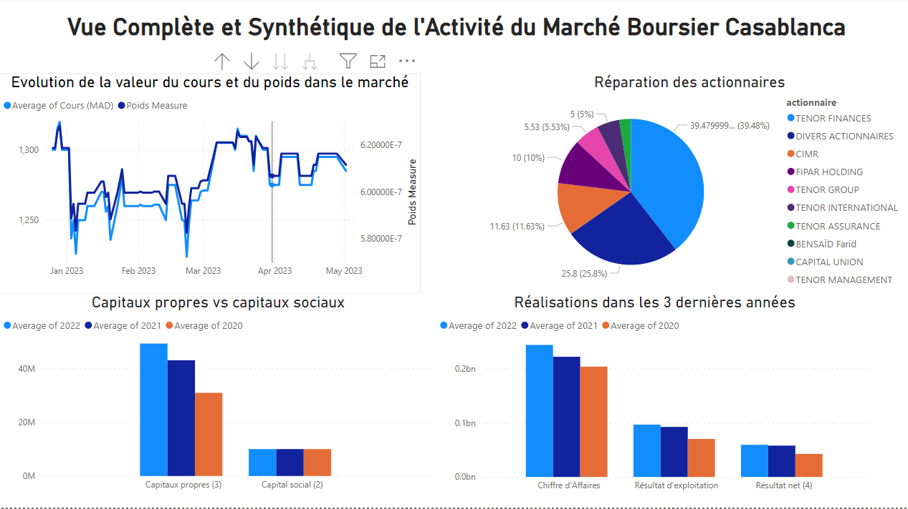

<h1 align="center">
  <br>
  <a href="https://www.casablanca-bourse.com/fr/live-market/emetteurs/AFM151215"></a>
  <br>
</h1>

<h4 align="center">A full data analysis project using Python, SSIS & PowerBI.</h4>


<p align="center">
  <a href="#problem">Problem</a> •
  <a href="#solution">Solution</a> •
  <a href="#how-to-use">How To Use</a> •
  <a href="#license">License</a>
</p>



## Problem

* The client needs `interactive data analysis tools` to explore and analyze their financial data in an `intuitive` and `user-friendly` manner.


## Solution

* We offer a comprehensive `Business Intelligence solution` that includes `automated extraction` and `transformation of financial data` from an unstructured web source, as well as the creation of a `dynamic and regularly updated dashboard`.

* We use Microsoft services such as `SSIS`, `PowerBI`, and `SQL Server` as well as `Python` with its various libraries for Web Scraping and Data Cleaning.

* We will ensure `structured data feeding` and the implementation of an audit dashboard `to track and evaluate` the performance of the solution.


## How To Use

To clone and run this application, you'll need [Git](https://git-scm.com) and [Python](https://www.python.org/) with a package manager such as [Anaconda](https://www.anaconda.com/download/) installed on your computer. 

From your command line:

```bash
# Clone this repository
$ git clone https://github.com/ismailouahbi/MarketShare_analysis.git

# Go into the repository
$ cd MarketShare_analysis

# Install dependencies
$ pip install -r requirements.txt

# Run the scripts [Using Jupyter Notebook or Google Collab]
### You will need to start by the first script 'scraping.ipynb' followed by data cleaning script and source database population 'data-cleaning.ipynb' 

$ jupyter notebook
```

> **Note**
> The data-cleaning.ipynb script contains the data cleaning steps as well as connexion to the source database in Sql Server along with its population


## License

MIT

---


**By:**

* [Hamza Khalid](https://hamzakhalid.me/)
* [Ismail Ouahbi](https://ismailouahbi.github.io/)


